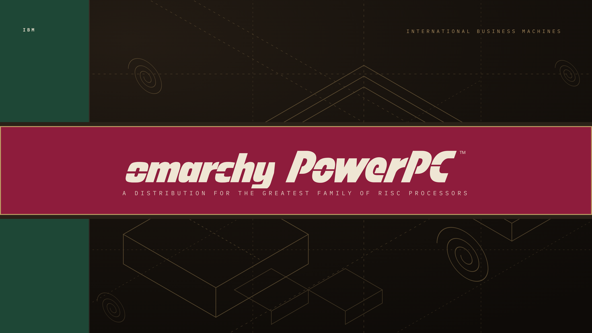

# PowerPC After Dark for Omarchy

The night half of PowerPC Classic. Same jacket, polarized for a dark session: near-black board stock, gold drafting lines, crimson pushed brighter so it still reads as action against ink.



## Install

Open the Omarchy Menu with `Super + Space`, then **Install > Style > Theme** and paste:

```text
https://github.com/<you>/omarchy-powerpc-after-dark-theme
```

Or from a terminal:

```bash
omarchy theme install https://github.com/<you>/omarchy-powerpc-after-dark-theme
```

Already installed an older copy? `omarchy theme update`, then select it again.

## What gets themed

This theme uses Omarchy's semantic `colors.toml` palette. Omarchy generates
and reloads its supported integrations when the theme is selected — shell,
Hyprland, terminals, editors, btop, browser chrome and lock screen — so there
is no directory of duplicated config files to maintain.

`mode = "dark"` puts GTK and app variants on their dark settings.

## Palette

| Role | Hex |
|---|---|
| Background | `#17120D` |
| Deep background | `#0E0B08` |
| Selection | `#3A2C1E` |
| Foreground | `#E4D8C0` |
| Accent / red | `#C3325A` |
| Green | `#4E9C7A` |
| Yellow | `#D2AE62` |
| Brown / gold | `#A98C5F` |
| Blue | `#7BA0C4` |
| Active border | `#C3325A` to `#BE9E64` |

Values are re-derived rather than inverted. The light theme's crimson
`#9E2044` sits at 2.4:1 on ink and reads as a smudge; it is lifted to
`#C3325A`. Forest goes `#2A5D4C` to `#4E9C7A`. Gold carries over unchanged —
it was always a mid-tone.

## Wallpapers

| File | Ground |
|---|---|
| `1.png` | The full jacket on near-black: spine, band, subtitle. |
| `2.png` | Same ground, omarchy alone in the band, larger. |

Both are dark, so the cycler never lands on a light wallpaper. The light set
lives in **powerpc-classic**.

## Customize

Installed themes live in `~/.config/omarchy/themes/`. Two files define this one:

- `colors.toml` — the shared palette Omarchy generates integrations from
- `hyprland.lua` — gradient borders, 8px rounding, gaps, shadow and motion

Re-select the theme after editing to regenerate. Local edits conflict with a
later `omarchy theme update`, so keep a copy if you maintain a variant.

## extras/

Omarchy 4 generates these from `colors.toml`, so they are **not** loaded from
here. They are kept as hand-tuned references if you want to override a
specific app: `btop.theme`, `waybar.css`, `walker.css`, `hyprlock.conf`,
`alacritty.toml`, `icons.theme`, and `logos/` (wordmarks with transparent
backgrounds). Copy any of them up one level only if your build still reads
theme-level app configs.

## Credits

Palette drawn from the dust jacket of *The PowerPC Architecture: A
Specification for a New Family of RISC Processors* (IBM / Morgan Kaufmann,
1994). The Omarchy integration, Hyprland treatment and wallpapers are
original.

Released under the [MIT License](LICENSE).
