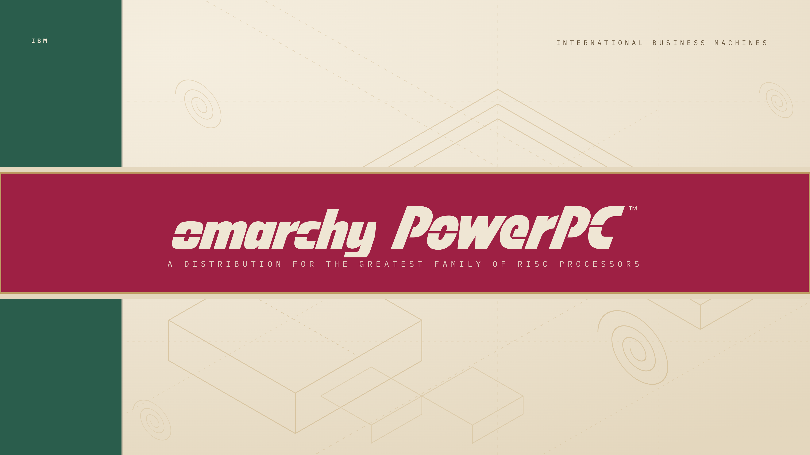

# PowerPC Classic for Omarchy

Cream book stock, forest-green spine, crimson band. A light theme taken from the dust jacket of IBM's 1994 PowerPC architecture manual — paper for surfaces, forest for structure, crimson for action, gold for rule-work.



## Install

Open the Omarchy Menu with `Super + Space`, then **Install > Style > Theme** and paste:

```text
https://github.com/<you>/omarchy-powerpc-classic-theme
```

Or from a terminal:

```bash
omarchy theme install https://github.com/<you>/omarchy-powerpc-classic-theme
```

Already installed an older copy? `omarchy theme update`, then select it again.

## What gets themed

This theme uses Omarchy's semantic `colors.toml` palette. Omarchy generates
and reloads its supported integrations when the theme is selected — shell,
Hyprland, terminals, editors, btop, browser chrome and lock screen — so there
is no directory of duplicated config files to maintain.

`mode = "light"` puts GTK and app variants on their light settings.

## Palette

| Role | Hex |
|---|---|
| Background | `#EFE6D4` |
| Dark background | `#E4D7BE` |
| Selection | `#E4D7BE` |
| Foreground | `#3B3229` |
| Accent / red | `#9E2044` |
| Green | `#2A5D4C` |
| Yellow | `#B07D2A` |
| Brown / gold | `#6B5940` |
| Blue | `#3A628C` |
| Active border | `#9E2044` to `#2A5D4C` |

## Wallpapers

| File | Ground |
|---|---|
| `1.png` | The dust jacket: spine, band, subtitle. |
| `2.png` | Paper only, no band. |
| `3.png` | Forest ground, white marks, crimson footer. |
| `4.png` | The jacket with omarchy alone in the band, larger. |

All four are light, so the cycler never lands on a dark wallpaper. The dark
pair lives in **powerpc-after-dark**.

## Customize

Installed themes live in `~/.config/omarchy/themes/`. Two files define this one:

- `colors.toml` — the shared palette Omarchy generates integrations from
- `hyprland.lua` — gradient borders, 8px rounding, gaps, shadow and motion

Re-select the theme after editing to regenerate. Local edits conflict with a
later `omarchy theme update`, so keep a copy if you maintain a variant.

## extras/

Omarchy 4 generates these from `colors.toml`, so they are **not** loaded from
here. They are kept as hand-tuned references if you want to override a
specific app: `btop.theme`, `waybar.css`, `walker.css`, `hyprlock.conf`,
`alacritty.toml`, `icons.theme`, and `logos/` (wordmarks with transparent
backgrounds). Copy any of them up one level only if your build still reads
theme-level app configs.

## Credits

Palette drawn from the dust jacket of *The PowerPC Architecture: A
Specification for a New Family of RISC Processors* (IBM / Morgan Kaufmann,
1994). The Omarchy integration, Hyprland treatment and wallpapers are
original.

Released under the [MIT License](LICENSE).
